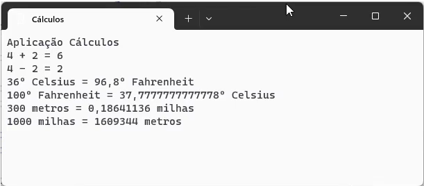

# Cálculos :1234:
 Aplicação C# para efetuar diversos tipos de cálculos

Desenvolvida no **_*âmbito da ação de formação*_** **"Introdução ao  Git e GitHub"**

## Operações suportadas

Neste momento esta aplicação implementa as seguintes operações:

- soma
- subtração
- conversão de temperaturas:
    - celsius :arrow_right: fahrenheit
    - fahrenheit :arrow_right: celsius
- conversão de distâncias:
    - metros :arrow_right: milhas
    - milhas :arrow_right: metros    

## Tecnologias utilizadas neste projeto

- **Visual Studio**
- C#
- Git
- GitHub
- GitHub Desktop
- Plataforma GitHub

## Site oficial

*A informação seguinte é apenas para experiência, não é válida na realidade...*

Faça download desta aplicação no site oficial: [www.calculos.com](https://www.calculos.com)